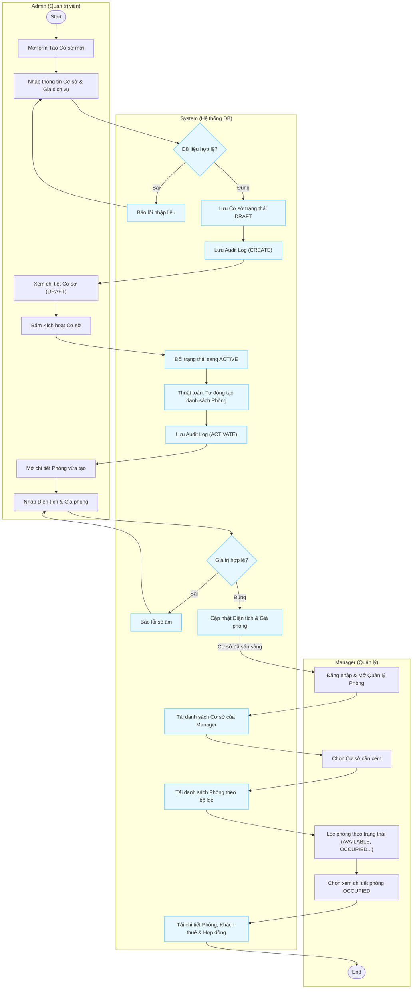

### 5. Luồng Quản lý Cơ sở vật chất và Phòng trọ (Room & Facility Management)

```mermaid
flowchart TD
    subgraph Admin ["Admin (Quản trị viên)"]
        Start(["Start"])
        A_OpenCreate["Mở form Tạo Cơ sở mới"]
        A_InputFac["Nhập thông tin Cơ sở & Giá dịch vụ"]
        A_Review["Xem chi tiết Cơ sở (DRAFT)"]
        A_Activate["Bấm Kích hoạt Cơ sở"]
        A_OpenRoom["Mở chi tiết Phòng vừa tạo"]
        A_UpdateRoom["Nhập Diện tích & Giá phòng"]
    end

    subgraph System ["System (Hệ thống DB)"]
        S_ValidFac{"Dữ liệu hợp lệ?"}
        S_ErrFac["Báo lỗi nhập liệu"]
        S_SaveDraft["Lưu Cơ sở trạng thái DRAFT"]
        S_Audit1["Lưu Audit Log (CREATE)"]
        
        S_UpdateActive["Đổi trạng thái sang ACTIVE"]
        S_GenRooms["Thuật toán: Tự động tạo danh sách Phòng"]
        S_Audit2["Lưu Audit Log (ACTIVATE)"]
        
        S_ValidRoom{"Giá trị hợp lệ?"}
        S_ErrRoom["Báo lỗi số âm"]
        S_SaveRoom["Cập nhật Diện tích & Giá phòng"]
        
        S_LoadManagerFac["Tải danh sách Cơ sở của Manager"]
        S_LoadRooms["Tải danh sách Phòng theo bộ lọc"]
        S_LoadDetail["Tải chi tiết Phòng, Khách thuê & Hợp đồng"]
    end

    subgraph Manager ["Manager (Quản lý)"]
        M_Login["Đăng nhập & Mở Quản lý Phòng"]
        M_SelectFac["Chọn Cơ sở cần xem"]
        M_FilterStatus["Lọc phòng theo trạng thái (AVAILABLE, OCCUPIED...)"]
        M_ViewRoom["Chọn xem chi tiết phòng OCCUPIED"]
        End(["End"])
    end

    %% Flow Admin Create Facility
    Start --> A_OpenCreate
    A_OpenCreate --> A_InputFac
    A_InputFac --> S_ValidFac
    
    S_ValidFac -- "Sai" --> S_ErrFac
    S_ErrFac --> A_InputFac
    
    S_ValidFac -- "Đúng" --> S_SaveDraft
    S_SaveDraft --> S_Audit1
    S_Audit1 --> A_Review

    %% Flow Admin Activate
    A_Review --> A_Activate
    A_Activate --> S_UpdateActive
    S_UpdateActive --> S_GenRooms
    S_GenRooms --> S_Audit2
    S_Audit2 --> A_OpenRoom

    %% Flow Admin Update Room
    A_OpenRoom --> A_UpdateRoom
    A_UpdateRoom --> S_ValidRoom
    
    S_ValidRoom -- "Sai" --> S_ErrRoom
    S_ErrRoom --> A_UpdateRoom
    
    S_ValidRoom -- "Đúng" --> S_SaveRoom
    
    %% Chuyển giao flow sang Manager
    S_SaveRoom -- "Cơ sở đã sẵn sàng" --> M_Login

    %% Flow Manager
    M_Login --> S_LoadManagerFac
    S_LoadManagerFac --> M_SelectFac
    M_SelectFac --> S_LoadRooms
    S_LoadRooms --> M_FilterStatus
    M_FilterStatus --> M_ViewRoom
    M_ViewRoom --> S_LoadDetail
    S_LoadDetail --> End

    %% Styling
    classDef sys fill:#e6f7ff,stroke:#91d5ff,stroke-width:2px;
    class S_ValidFac,S_ErrFac,S_SaveDraft,S_Audit1,S_UpdateActive,S_GenRooms,S_Audit2,S_ValidRoom,S_ErrRoom,S_SaveRoom,S_LoadManagerFac,S_LoadRooms,S_LoadDetail sys;
```
