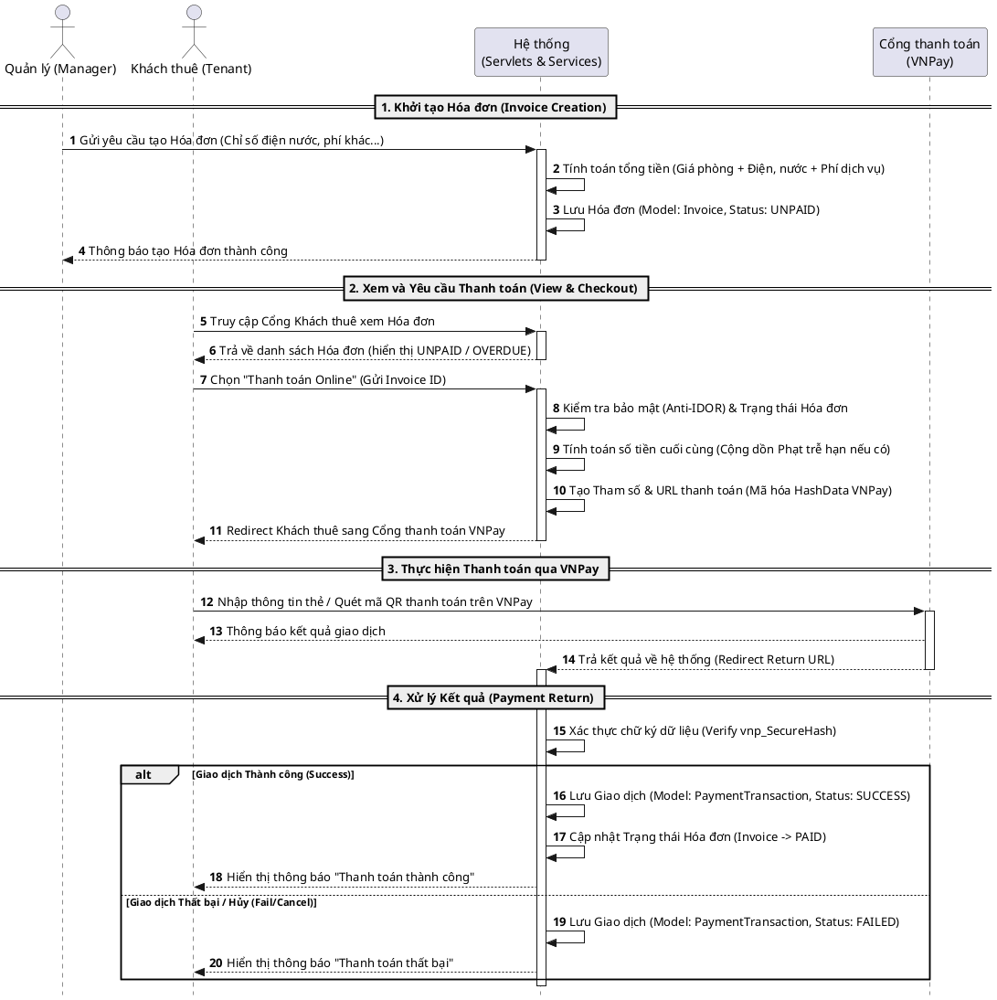

# Luồng Quản lý Hợp đồng và Khách thuê (Contract & Tenant Management)

Dựa trên hình ảnh minh họa quy trình mà bạn đã cung cấp trước đó, mình đã điều chỉnh lại cấu trúc biểu đồ sang dạng **Flowchart chia theo các làn bơi (Swimlanes)**. Cấu trúc này sẽ giúp bạn nhìn rõ luồng nghiệp vụ chạy ngang qua các actor/component: Khách thuê, Quản lý, Hệ thống và Dịch vụ Email.

```mermaid
flowchart TD
    %%====================================
    %% ĐỊNH NGHĨA CÁC SWIMLANES
    %%====================================
    subgraph Tenant ["Khách thuê (Tenant)"]
        direction TB
        T1([Bắt đầu thuê])
        T2[Nhận email chứa<br/>Tài khoản & Mật khẩu]
        T3[Đăng nhập hệ thống]
        T4[Cung cấp thông tin<br/>Người phụ thuộc]
        T5[Xem danh sách<br/>Người phụ thuộc]
        T6([Hoàn tất & Rời phòng])
    end

    subgraph Manager ["Quản lý (Manager)"]
        direction TB
        M1([Bắt đầu])
        M2[Tạo Hợp đồng thuê phòng]
        M3[Thêm tài khoản<br/>Khách thuê (từ HĐ)]
        M4[Xác nhận Thêm<br/>Người phụ thuộc]
        M5[Yêu cầu<br/>Kết thúc thuê]
    end

    subgraph System ["Hệ thống (System)"]
        direction TB
        S1[Lưu thông tin Hợp đồng]
        S2{Email/Username<br/>đã tồn tại?}
        S3[Kích hoạt lại<br/>User cũ]
        S4[Tạo User mới<br/>Role: TENANT]
        S5[Cập nhật Phòng:<br/>OCCUPIED]
        S6[Cập nhật Hợp đồng:<br/>Gắn TenantId]
        S7[Lưu thông tin<br/>Dependent]
        S8[Giải phóng Phòng:<br/>AVAILABLE]
        S9[Khóa tài khoản User:<br/>INACTIVE]
        S10[Đóng Hợp đồng:<br/>INACTIVE]
    end

    subgraph EmailService ["Dịch vụ Email"]
        direction TB
        E1[Phát hành Email<br/>thông báo]
    end

    %%====================================
    %% CÁC LUỒNG TƯƠNG TÁC
    %%====================================
    %% 1. Khởi tạo Hợp đồng
    M1 --> M2
    M2 --> S1
    
    %% 2. Phân phòng & Kích hoạt tài khoản
    S1 --> M3
    M3 --> S2
    
    %% Quyết định: Tài khoản cũ hay mới
    S2 -- "Đã có" --> S3
    S2 -- "Chưa có" --> S4
    
    S3 --> S5
    S4 --> S5
    S5 --> S6
    
    %% 3. Gửi Email thông báo
    S6 --> E1
    E1 --> T2
    
    %% Khách thuê vào hệ thống
    T1 -.-> T2
    T2 --> T3
    
    %% 4. Quản lý Người phụ thuộc
    T3 --> T4
    T4 -- "Gửi giấy tờ/thông tin" --> M4
    M4 --> S7
    S7 --> T5
    
    %% 5. Kết thúc Hợp đồng
    T5 -. "Hết hạn thuê" .-> M5
    M5 --> S8
    S8 --> S9
    S9 --> S10
    S10 --> T6
```

---

# 3. Luồng Xuất Hóa Đơn và Thanh toán Online (Invoice & Online Payment Flow)

Dưới đây là sơ đồ tuần tự (Sequence Diagram) được viết bằng **PlantUML** mô tả quá trình tạo hóa đơn bởi Quản lý và quá trình thanh toán qua cổng VNPay của Khách thuê.


