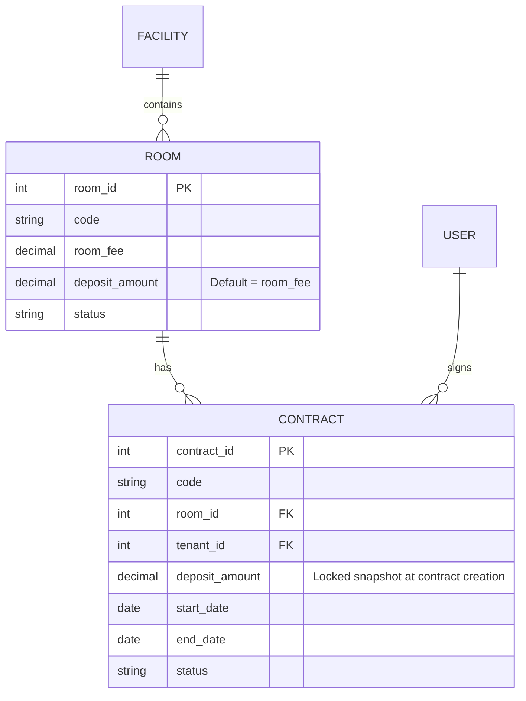

# Phase 1 Data Model: Equalize Deposit Amount with Room Fee

## Entities & Relationships

## Validation Rules

1. **Room Creation/Update**:
   - `room_fee` MUST be a positive number (`room_fee > 0`).
   - `deposit_amount` defaults to `room_fee` unless explicitly specified.

2. **Contract Creation**:
   - `contract.deposit_amount` is initialized to `room.room_fee` (or `room.deposit_amount`).
   - Must be locked into `dbo.contracts` table upon creation.

3. **Contract View & Print**:
   - `deposit_amount` MUST be rendered with thousand separators (e.g., `2,500,000 đ`).
